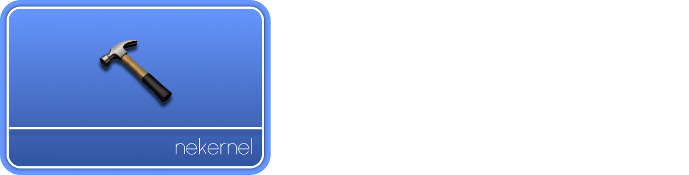

<!-- Read Me of NeCTI -->

<div align="center">
  
</div>

<br/>


[](LICENSE)

## Overview:

NeCTI is a modern, multi-platform compiler instractucture designed for modularity, and performance. It features a custom debugger engine, advanced linker, and a modular compiler architecture. It is built for research, education, and next-generation toolchain development.

## Structure:

- `src/CompilerKit` – Compiler Kit written in modern C++
- `src/LibC++` – C++ ABI Library
- `src/LibStdC++` – Standard C++ Library
- `src/DebuggerKit` – Debugging Kit written in modern C++
- `src/Tools/` – C/C++ Frontend Tools


## Requirements:

- [Clang](https://clang.llvm.org/)
- [Git](https://git-scm.com/)
- [Boost](https://boost.org/)
- [NeBuild](https://github.com/nekernel-org/nebuild)
- [Doxygen](https://www.doxygen.nl/)

## Notice for Contributors:

Always use `format.sh` before commiting and pushing your code!

## Getting Started:

Run the following:

```sh
git clone git@github.com:nekernel-org/necti.git
cd necti
# Either build the debugger or compiler libraries/tools using nebuild.
```

And build the source tree using the NeBuild system.

## Security

- **Vulnerability Disclosure:**  
  Please report security issues privately via email or GitHub Security Advisories.

## Authors & Credits

- **Amlal El Mahrouss** — Lead Developer and Compiler Architect.
- [Full contributor list](https://github.com/nekernel-org/necti/graphs/contributors)

---

## License

This project is licensed under the [Apache-2.0 License](LICENSE).

<div align="center">
  <sub>
    &copy; 2024-2025 Amlal El Mahrouss & NeKernel contributors. Licensed under the Apache 2.0 license.
  </sub>
</div>