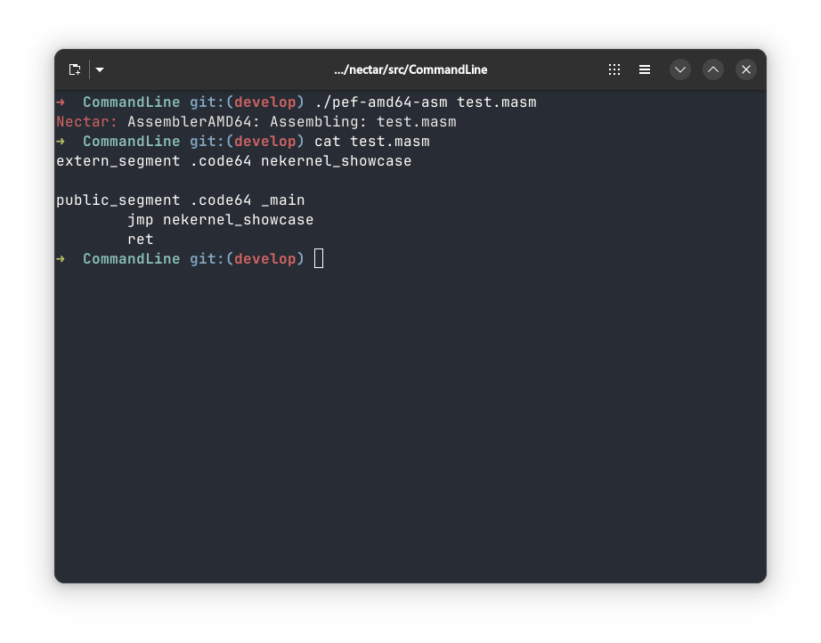

<!-- Read Me of Nectar -->

# 🍯 The Nectar Systems Language.

<a href="LICENSE"></a>


# About:

A systems programming language for the 21st century.

## Getting Started:

### Quick Install: (POSIX)

```sh
curl -fsSL http://install.nectar.nekernel.org | sh
```

### Structure:

- `src/CompilerKit` – Compiler Kit written in C++.
- `include/GenericsLibrary` – Nectar Generics Library.
- `include/CoreRuntime` – Nectar Core Libraries. (C++/Nectar)
- `include/ThirdParty` – Third Party Modules.
- `src/DebuggerKit` – Debugging Kit written in C++.
- `src/CommandLine` – C/Nectar/C++ Command Line Tools.

### Requirements:

- [Clang](https://clang.llvm.org/)
- [Git](https://git-scm.com/)
- [Boost](https://boost.org/) (1.90.0+)
- [NeBuild](https://github.com/ne-foss-org/nebuild)
- [Doxygen](https://www.doxygen.nl/)
- GNU CoreUtils
- [Git](https://git-scm.com/)
- [OCL.TProc](https://github.com/ocl-foss/tproc) (1.61.0+)

### Notice for Contributors:

Always use `format.sh` before commiting and pushing your code!

### Building:

Run the following:

```sh
git clone -j8 git@github.com:ne-foss-org/nectar.git
cd nectar
# Either build the debugger or compiler libraries/tools using nebuild.
```

And build the source tree using the NeBuild system.

### Security

- **Vulnerability Disclosure:**
  Please report security issues privately via email or GitHub Security Advisories.

### Authors & Credits

- **Amlal El Mahrouss** — Lead Developer and Compiler Architect.
- [Full contributor list](https://github.com/ne-foss-org/nectar/graphs/contributors)

## Community:

Join our [Discord](https://discord.gg/uD76Qweght), we're quite active and open for contributors!

### Figures:

#### Figure 1: The Nectar AMD64 Assembler for NeKernel ABI.



---

### License

This project is licensed under the [Apache-2.0 License](LICENSE).

<div align="center">
  <sub>
    &copy; 2023-2026 Amlal El Mahrouss & Ne.app contributors. Licensed under the Apache 2.0 license.
  </sub>
</div>
